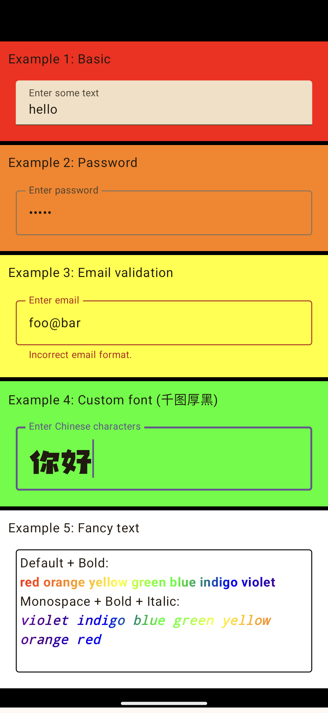

# Table of contents
- Example 1: A basic example
- Example 2: Hide the password
- Example 3: Validate the email format
- Example 4: Display a custom font. The custom font file is at `res/font/qian_tu_hou_hei_ti.ttf`
- Example 5: Style text using a brush and color gradients 

Reference: https://developer.android.com/develop/ui/compose/text

  <h1>Screenshot</h1>
  

