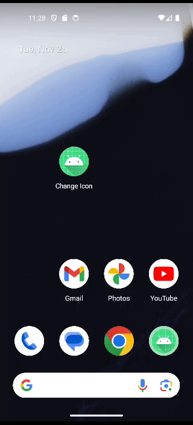

This example is inspired by the Duolingo app and LinkedIn app that change the app icon dynamically based on certain trigger events. The experience is fun and engaging so I want to learn how to do that.

  Icon image credit:
  <a href="https://www.flaticon.com/free-icons/thanksgiving" title="thanksgiving icons">Thanksgiving icons created by Freepik - Flaticon</a>

# Demo

