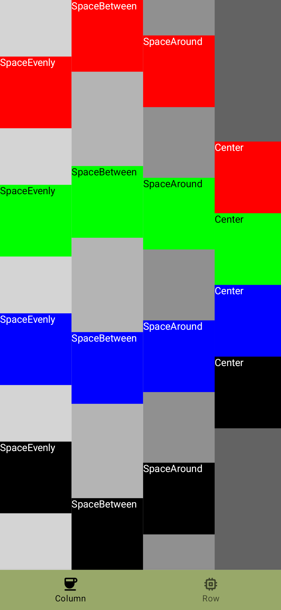
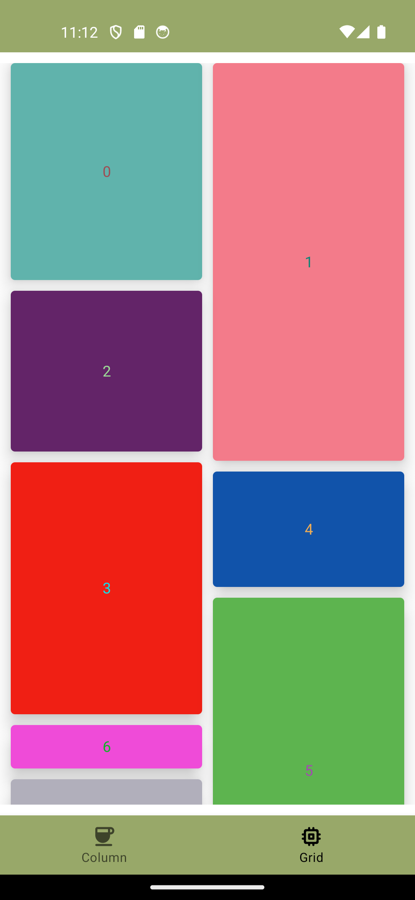

# Table of contents
- Example 1: Column layout. [Reference](https://developer.android.com/reference/kotlin/androidx/compose/foundation/layout/package-summary#Column(androidx.compose.ui.Modifier,androidx.compose.foundation.layout.Arrangement.Vertical,androidx.compose.ui.Alignment.Horizontal,kotlin.Function1)(androidx.compose.ui.Modifier,androidx.compose.foundation.layout.Arrangement.Vertical,androidx.compose.ui.Alignment.Horizontal,kotlin.Function1))
- Example 2: Staggered lazy vertical grid. [Reference](https://developer.android.com/develop/ui/compose/lists#lazy-staggered-grid)

  <h1>Screenshot</h1>
  

  <h1>Screenshot</h1>
  

